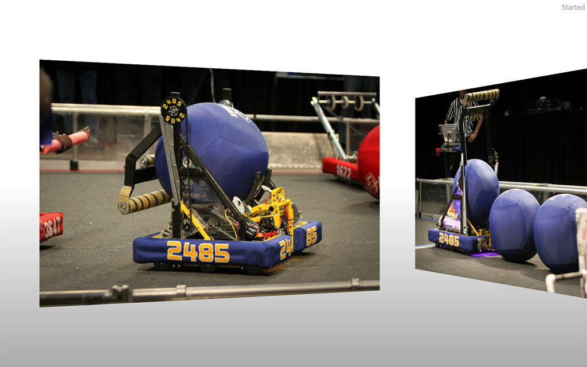

# Kinect Photo Gallery

Pan through and enlarge a gallery of photos using the Kinect. This project was not used during competition and is a little buggy.

WPF's 3D capabilities are used for rendering the photo planes.

## Gestures

Wave to start interacting.

- Move your hand hand left and right to pan
- "Push" an image to enlarge it
- Drop your hand to stop interacting
