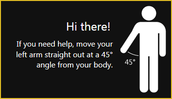

# Kinect CAD Explorer

Using a Kinect in our [FRC](http://www.usfirst.org/roboticsprograms/frc) team pit to manipulate our robot's CAD assembly in SolidWorks.

This project uses the Microsoft Kinect SDK v1.8 to detect users' skeletons and report their positions and gestures. Hand shape recognition was added in SDK 1.7 and is used for grip detection.

This program takes input gestures from the Kinect and converts them into SolidWorks commands. These commands are sent to SolidWorks using the SolidWorks API SDK.

For explode support, the SolidWorks model must have an explode animation with the name "KinectExplode" (or as configured in the `App.config` file included with the built executable).
Other settings such as motion study length and animation length can be configured in the config file as well.

## Gestures

Two major gestures are currently supported.
To view the help screen, use the Xbox guide gesture.

[Help window](../img/rotate3d-help.png)

#### Rotating

"Grip" the model with one fist (probably with your other arm at your side) and move your fist around on all axes.
The model will rotate and zoom.

#### Exploding

Grip with both hands and pull your hands outward or push them inward. Use the circles onscreen as guides.
The model will play the explode animation or collapse animation based on your hand movement.

## Prerequisites

 - Microsoft .NET Framework 4.5 ([download][dotnet])
 - Microsoft Kinect SDK 1.8 ([download][kinect])
 - SolidWorks API SDK 2012 (found on SolidWorks installation disk under `apisdk/`)

[dotnet]: http://www.microsoft.com/en-us/download/details.aspx?id=30653
[kinect]: http://www.microsoft.com/en-us/download/details.aspx?id=40278

### Required libraries at runtime

These should be in the same folder as `KinectRotate3D.exe`.

 - `KinectInteraction170_32.dll`
 - `KinectInteraction170_64.dll`
 - `Microsoft.Kinect.Toolkit.Interaction.dll`
